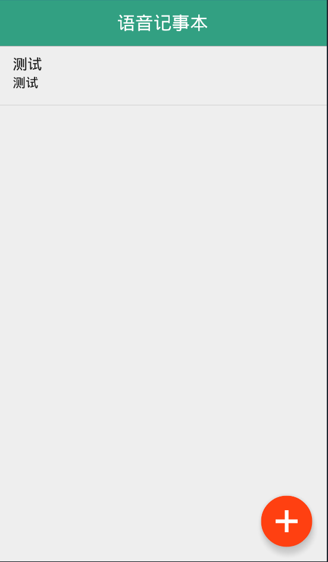
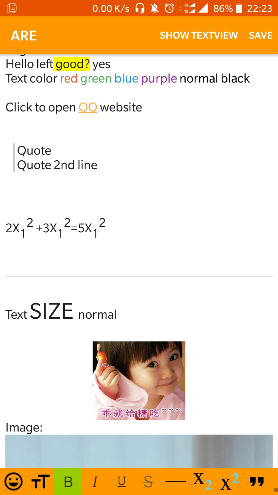
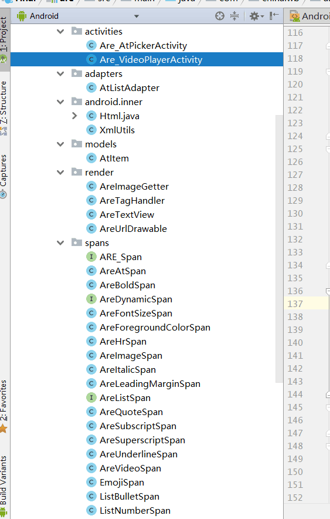
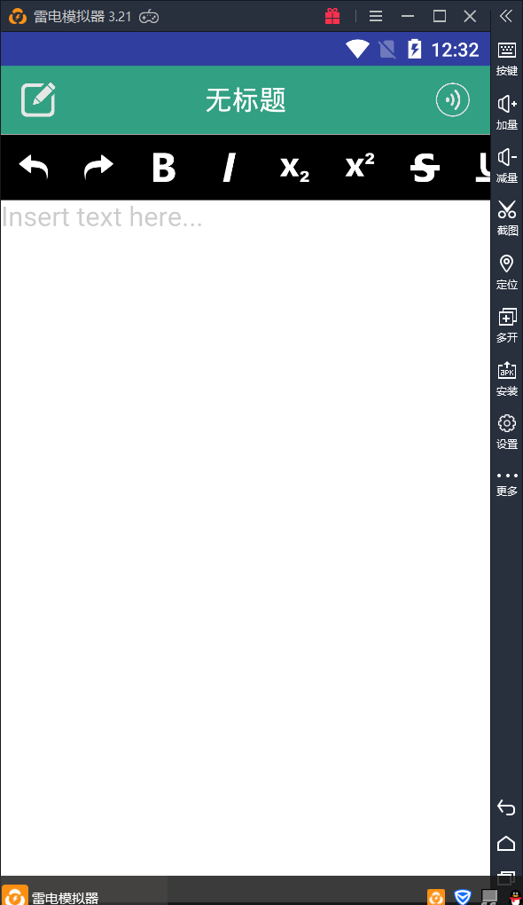
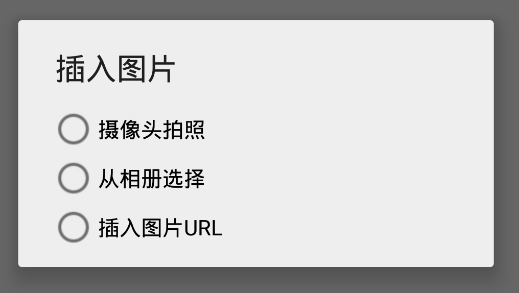
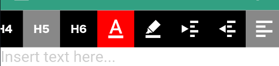

# VoiceNote
    最终的效果图
<center>
  <figure class="half">
      
      
    </figure>
</center>

## 实现语音识别、语音合成
---
　　语音识别和合成依赖`科大讯飞`的SDK来完成,从官网进行注册申请,下载对应功能的SDK压缩包,里面包含恨的文件,并且每个SDK包对应唯一的APPID用来对语音引擎进行初始化,所有包的签名必须一致,否则不能进行使用。  

这里将识别和合成分别封装成两个工具类,拥有各自功能的静态方法,方便调用,当new这个工具类对象的时候,在构造器中使用A对应的PPID完成对语音引擎的初始化,合成和识别都需要进行参数设置,这里参考官方给出的demo。  
语音合成的回调方法中,会返回识别的结果,是一个json对象,需要使用官方给的json解析器对其进行解析来得到语音识别的结果,语音识别的过程中会多次调用这个方法,返回多个json对象,最后一次的json为一次识别的完整的识别结果。使用回调方法中得到字符串,将它`setText()`到`EditText`中就实现了语音识别输入。

　　语音合成比起语音识别来说就更加简单,只需要将字符串传给语音合成对象,就可以实现语音合成。分封类中停止识别和合成的方法,用来中断语音引擎,方便使用。

　　需要注意的地方是,所有的语音识别和合成都是单例对象,所以在使用完后最好是销毁这个对象,再次调用的时候再新建,另外就是开启语音识别和语音和成会开启新的线程,主线程不会等待识别或者合成方法的结束,会继续向下执行,因此如果有需要等待执行的操作,比如说主线程要获取到语音识别的结果,而这不是同一个线程的操作,就引入了并发,而主线程不能进入sleep等待这个线程结束返回结果,因为主线程休眠就会失去响应,也就是界面停止死机,等待时间过长安卓系统就会提示程序无响应,甚至停止,所以得极力避免这种情况。

---

## 数据库的储存和读取
　　安卓拥有自带的数据库`SQLite3`,他的增删改语句跟数据库类似,是安卓上的微型本地数据库。需要实现`xtends SQLiteOpenHelper`,使用了`ContentValues`来简化了对数据的操作。
保存文件的思路就是设置三个字段,一个为标题,一个为内容,以及一个自增的主键id,将得到编辑器中的html代码,使用java中的正则表达式先去掉文本内容的所有的`<html>`标签,截取到第一个换行符并且长度不大于15的内容来作为文章标题,正文内容就直接保存获取到的html代码。　　

　　截取标题的操作放在保存文章的操作发生的时候,这样主页面加载所有条目的时候直接获取标题即可对数据的操作两个页面都有使用,主页面负责从数据读取数据,在从添加修改的页面跳转回来的时候主页面重新从数据库进行重新读取,以过得从编辑页面进行的新增数据。另一个同步发生在下拉刷新的时候,这里使用了`SwipeRefreshLayout`来包含`ListView`实现下拉刷新,在监听到下拉操作的时候触发主动刷新操作,更新数据库的内容。点击新增按钮或者是加载出的所有的笔记条目,都会调转到编辑界面,在主界面启动编辑页面之前,如果是已经存在的条目,会使用Intent将条目id作为数据发送给编辑页面。

　　从数据库读取的操作使用了2个`List`和1个`List<Map<String,Stirng>>`,其中一个list用来储存主键,一个用来储存html代码,
编辑页面的功能就是对数据进行储存和更改,添加一个`boolean modify`作为新增和修改的区分标志,为`true`的时候就是对数据进行更新操作,为`false`的时候进行插入操作,在为`true`的操作中增加一个删除判断,页面菜单中增加了清空按钮,点击清空按钮就会调用将编辑器的中`html`置为`""`空串,做一个	`if("".equals(meditor.getHtml()))`使用获得的主键id,对其所指向的进行删除操作.  

---
## 富文本支持
最开始就是想使用现成的富文本项目,找了很多,觉得不尽人意,最后终于找到了一款叫做ARE的开源项目,效果如下图所示：
<center>
  
</center>

这是找了很久找找到的一个开源的编辑器,他的功能满足我的所有的要求,也是我付出功夫最多的一个编辑器,支持需要的图片文字混合编辑,支持本地选择图片,但是不支持摄像头拍照,所以就想修改源码实现摄像头拍照,不得不说,工程源码是真的恐怖,单纯一个are的目录结构(如图所示)就让人觉得恐怖,除此之外还有个三个项目模块作为依赖。里面的各种回调方法更是多的恐怖。

　　在刚开始调用他的自定义模块的时候,发现图片不能够加载,最后在摸索很久终于明白,图片选择的实现是在`onActivityResult()`中调用`editor`编辑器控件的方法来实现插入图片。因为选择图片和摄像头拍照最后都是会回到当前活动,所以在`onActivityResult()`就可以接受请求和返回的`Intent`数据
<center>
  
</center>　　

　　插入图片的html格式是,这里可以是网站上的图片,也可以是本地的照片,网站照片path是http开头,本地的照片路径是corront://com.chenyiAlone.voiceDemoT(报名)这种形式,这个框架的本身已经实现从相册读取图片,并储存图片的这个路径赋值给imgPath并加载到html语句中,这个框架还可以将html文件保存到手机中。
因为要实现拍照并加载图片,思路就变成了保存拍照获取到的图片到手机储存中,并将图片的路径保存到html实现加载,本着这个思路在制作的过程中又碰到了问题：如果直接使用html中的指定手机内的图片文件,并不能实现加载。于是使用这个框架本身自带的从相册插入图片的操作,在源码中使用Log在将图片加载到html之后,输出一下图片对应html代码,然后将它设置到编辑器的设置AREEditor.formHtml(String html) 方法,依旧不能实现从本地加载,至此得出结论：这个开源框架并不能将本地图片实现预加载,可我想的是将代码保存以后再一次编辑的时候依旧可以看到原来的所有的格式、图片,这个框架并不达到我的预期,只能狠心放弃
<center>
  
</center>

　　最后使用的是Github的RichText开源项目如上图所示,原理就是依旧是解析html语法,来实现富文本编辑,开源框架很强大,给足了功能,而且之前不能实现本地图片文件预加载的功能也完美的实现了,(唯一的问题就是图片插入后会莫名的被放大),也就是保存的含有本地图片的html文件再打开时候还能够能够加载出来。但是这个开源项目中只给出了一个非常简单的demo,有的只是给你了框架,而且很多功能并没有真正的实现,还有一些实现的功能,但是很鸡肋。想要的插入图片的功能也没有实现,正好有了实验调用摄像头的机会。　　
　　这个开源框架的插入图片的底层方法依旧是插入html代码,这里想要实现插入图片的功能,想要插入图片,只需要获取到图片的准确路径,使用mEditor. insertImage(String url,String alt);将路径作为形参url即可插入,后面的alt是为了实现图片的点击功能,不得不佩服这个开源框架的强大。
```java
Intent intent-new Intent(action："android.intent.action.GET_CONTENT");
intent.setType("image/xxx");
startActivityForResult(intent,CHOOSE_PHOTO); //打开相册
```
　　从相册获取图片的代码就是课本上的代码,只是将最后解析图片的data的过程更改为了获取uri的path,使用插入图片的方法完成插入。


```java
Intent intent=new Intent(MediaStore.ACTION_IWAGE_CAPTURE);//调用系统相机
String filellame-DateForwat.format(inFormat："yyylwidd_hhmmss",Calendar.getInstance(Locale.CHTMA))+"".jpg);
    picture = new File(parent Environment.getExternat StoregeDtrectory().getAbsolutePath()+"/voicenote",filelame);
    Uri imageUri·Uri.fromfile(picture);
intent.putExtra(MediaStore.EXTRAL_OUTPUT,1mageUri);//直接使用,没有缩小
startActivityForResult(intent,requestCode：100);//100是请求码
```

　　从摄像头获取图片使用的不是原版的课本的代码,课本上的例子实现了显示在页面上,但是每次调用摄像头都会将原来的图片进行覆盖,因为所有的图片的都是用的是同一名称,而且有如果存在就删除的操作,图片插入操作不能唯一,若果直接使用会让后面的拍摄的图片替换原来的图片的路径,如果这样,那么插入的图片就会全部变成最后插入的图片,而且再次打开记事本的时候这个文件也不一定存在,出现图片无法加载。解决思路就是以不同的名字保存图片到指定的路径,并且不重复,所以在保存文件的时候增加了DateFormat.format("yyyyMMdd_hhmmss", Calendar.getInstance(Locale.CHINA)) + ".jpg"来作为图片的名称,使用Caldendar来获取当前时间,并输出为’年月日_小时分钟秒’.jpg的文件名,这样图片不会重复确保了唯一性。
　　两种插入图片的操作都是startActivityForResult()使用启动活动,最后在onActivityResult()中进行图片的插入操作,

```java
@Override protected void onActivityResult(int requestCode,int result,Intent data){
  String name=DateFormat.forwat(inFormat"yyyywdd_hhmss",Calendar.getInstance(Locale.CHTNA)).toString();
  Toast.mokeText(Main2Activity.this,"req"+requestCode+"result"+result)if(result==-18&requestCode==1ee){//result返回的是-1表示拍照成功返回的是e表示拍照失败
    Uri uri-Uri.fromFile(picture);
    Intent intent =new Intent(Intent.ACTION MEOIAL_SCANWER_SCAN_FILE);intent.setData(uri);
  this.sendBroadcast(intent);//这里我们发送广播i让MedtoScanner扫描我们制定的文件
  mEditor.insertImage(uri.getPath(),name);//这样在系统的相册中我们就可以找到我们拍摄的照片了
else if(result-1&&requestCode--CHOOSE_PHOTO) {
    Uri urt-data.getDoto();
    String path-handleImageOnKitKat(data);
    mEditor.insertImage(path,name);
    Toost.mokeText(Editoracitvity.thts,path,Toost.LENGTHLLONG).shov();
}
```

　　除了这两种方式之外我想到了上个开源项目中插入网站url图片的操作,在mEditor设置html为百度的图片,发现确实可行。在这里是用了自定义对话框来实现二级菜单选择,完成这三种插入的选择操作

<center>
  
</center>

　　除了插入图片之外,还解决了这个原版Demo的其他的问题,在一些两种状态的按钮上增加了设置背景,在选中的时候背景为灰色,未选中为黑色,这样就可以实现更好的交互,更好的使用体验。

<center>
  
</center>

　　原来的Demo中字体颜色的设置只有两种,黑色和红色,只有两种颜色太过于单调,看来一下源码中使用`mEditor.setTextColor(int color);`就能够简单的设置多种颜色了,于是为这个设置增加了设置颜色的if循环如下图所示。
```java
final ImageButton imageButton =findViewById(R. id. action_txt_color); imageButton. setOnClickListener(new View. OnClickListener(){
    @ Override public void onClick(View v){
        if(frontColor==Color. BLACK){
        frontColor=Color. RED;
        } else if(frontColor==Color. RED){
        frontColor=Color. YELLOW; } else if(frontColor==Color. YELLOW){
        frontColor=Color. GREEN;
        } else if(frontColor==Color. GREEN){
        frontColor=Color. BLUE;
        } else if(frontColor==Color. BLUE){
        frontColor=Color. BLACK;
    }
    mEditor. setTextColor(frontColor); imageButton. setBackgroundColor(frontColor); }
});
```
## 布局设计
    主要的布局一共两个,他们使用的是一个共同的自定义类继承LinearLayout,增加多个布局用来设置和显示指定的内容,这个公用的布局类的核心代码如下所示：
```java
/**--设置内容-*/
View barlayoutView=View.inflate(getContext()，R.layout.Layout_common_toolbar，root:null);
Button leftBtn=(Button)barLayoutView.findViewById(R.id.toolbar_left_btn);
TextView leftTv=(TextView)barLayoutView.findViewById(R.id.toolbar_.Left_tv);
TextView titleTv=(TextView)barLayoutView.findViewById(R.id.toolbar_title_tv);
Button rightBtn=(Button)barLayoutView.findviewById(R.id.toolbar_right_btn);
TextView rightTv=(TextView)barLayoutView.findViewById(R.id.toolbar_right_tv);
Relativelayout barRlyt=(RelativeLayout)barLayoutView.findViewById(R.id.toolbar_content_rlyt);
```

　　使用`TypedArray typedArray = getContext(). obtainStyledAttributes(attrs, R.styleable.CustomToolBar);`可以在布局的使用的设置属性,最后将`barRiyt使用addView(attrs);`加载。  

　　在活动中可以对这个布局类进行动态设置,例如在跳转到编辑页面的时候将`tittle`这知道标题栏。
主活动布局中使用了`FloatingActionButton`悬浮按钮,编辑页面的布局中使用了指定位置弹出菜单代码如下：

```java
private void shouPopupttenu(View view)(//View当前PopupMen显示的相对Vie的位置
PopupMenu popuptenus new PopupiMenu(context:this，view);//menu布局
popupMenu.getMenuInflater().inflate(R.menu.moin，popuplMenu.getMenu());//menu的ieem点市事件
popupMenu.setOnlenuItemclickListener((item)-(switch(item.getItemld()){
  case R.id.action_delete：
    aEditor.setHtml("");
    break;
  case R.id.action.copy：
    String str =delHTNL Tag(mEdsitor.getHtml());
    ClipboardManager cms(Clipboardlanager)getSystemService(Context.CLIPBOARD_SERVICE);
    //将文本内容放到系貌剪贴板里。
    ce.setText(str);
    Toast.makeText(context:EditorAcitvity.this，text："复制成功"，Toast.LENGTL_SHORT).));
    Toast.makeText(getApplicationContext()，item.getTitle()，Toast.LENGTW_SMORT).shou();return false;));
    //PopupNenu关闭事件popupMenu.setOnDisaissListener((menu)-{
    Toost，mokerext(getAppticationContext()，"关闭PopuplWenu"，Toost，LENGM SHORT).show));));
    popupiMenu.shonu());
```
　　使用PopupMenu来指定上下文对象,点击触发菜单的按钮,以及设置菜单对应的`menu.xml`,再设置菜单的点击监听,以及菜单的关闭监听(这里没用到),最后`show()`菜单,调用的时候在指定的按钮的监听中使用这个封装的方法,将被点击的对象传入,即可完成在指定的按钮周围弹出菜单。


## 总结
### 出现的问题及解决方案
>1. 导入项目。  

    很多github的项目导入Android Studio是不能正常编译的,像很多地方需要改,这里我找到了一个将项目快速编译打开的方法,将项目下载下来并解压,用Android Studio新建一项目,然后在他的目录下,将下面这几个文件复制到下载工程文件中进行覆盖


图 需要复制的文件
> 2.	Android Studio 3.+不能导入模块

    不知道为什么我的`Android Studio 3.1.2`不能导入模块,导入以后没有反应,在工程目录下其实已经将它导入进来了,但是却不能够正常显示在工程中,也不能正常添加依赖。解决办法不通用,在使用ARE的时候终于将它入进来。
      a)现将需要添加的模块复制到工程目录下,复制之前最好使用1中的方法打开项目一下
      b)在`setting.gradle`中将复制进来的模块的名称使用include':app',':are',这种格式来完成引入
      c)在`build.gradle`将所有的2.+的依赖方式改完3.+(详见3)
      d)模块以及主工程的`build.gradle`中a`ppcompat`更换为相同版本

> 3.	Android 3.0不能打开2.+的项目

    3.+中的依赖添加的方式比起2.+的compile改为了api(等价于compile)、implementation。详细如下所示：

> 4.	依赖不能下载

    在使用晚上的开源项目,添加依赖编译失败。起初以为是因为资源文件不行,后来查了又说改端口,再后来又用vpn翻墙,依旧不能解决,最后把gradle.properties中的代理设置全部注解了就好了


### 心得体会
>    这次的实训,被环境限制了,如果一开始就可以完整使用项目,感觉会提前非常多完成任务,正常开始写代码的时间不是很多,都浪费在了环境上,工欲善其事,必先利其器,总的来说也是学到了很多,代码上的没多少,可是这个Android Studio的问题确实让我收获了真的多。如何导入项目,如何解决编译问题,如何使用开源项目…收获很多,上面可能写的够曲折了,实际情况其实更惨,不过解决了就是有收获嘛,满意的实训。
